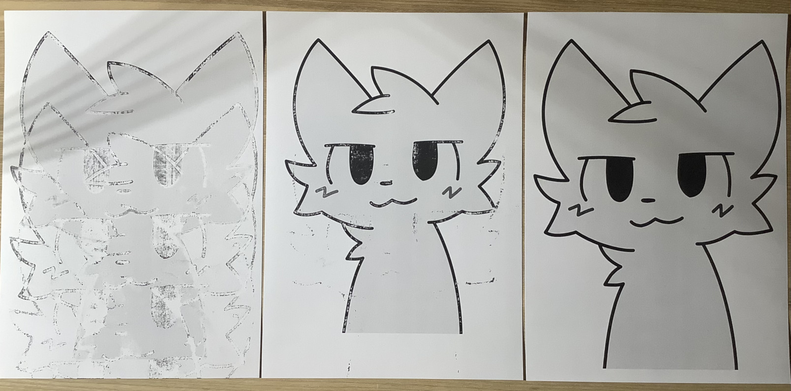

Linux HP Laserjet 1010/1015 paper type settings
==
## WHAT IS IT

This patch restores the lost paper type setting for Hewlet Packard Laserjet 1010 and Laserjet 1015



Left: "Light" mode for thick paper (250 g/m2)
Center: "Plain" mode for same paper.
Right "Rough" mode for same paper.

Right speed and fuser temperature are essential for good print.

The printer itself supports 14 types of paper:

Menu entry   | ?Printer mode?
-------------|---------------
Bond         | Thick
Cardstock    | Extra Rough
Color        | Normal
Envelope     | Envelope
Heavy        | Thick
Labels       | Thick
Letterhead   | Normal
Light        | Light
Plain        | Normal
Preprinted   | Normal
Prepunched   | Normal
Recycled     | Normal
Rough        | Thick
Transparency | Light

## INSTALLATION
(My OS Ubuntu 23.10)

1. Enable source code repositories in Ubuntu
In the **Software & Updates** (software-properties-gtk) check **Ubuntu Software -> Source Code**
(Alternatively you can enable source code repositories by uncommenting deb-src repositories from /etc/apt/sources.list)

Then
```bash
# change working directory to something what you want
mkdir ~/Desktop/printer_patch
cd ~/Desktop/printer_patch

# clone this repository
sudo apt install git
git clone https://github.com/sovahc/hplip_Laserjet_1010_1015_patch.git

# install hplip build dependencies
sudo apt build-dep hplip

# get hplip source code (will be unpacked into current directory)
apt source hplip

# go to hplip source code directory
cd hplip-3*

# apply this patch
patch -p1 <../hplip_Laserjet_1010_1015_patch/my.patch

# three files will be patched

# this also needed
sudo apt install fakeroot

# for sure
sudo apt build-dep hello

# build .deb package
dpkg-buildpackage -rfakeroot -uc -b

# up to generated .deb files
cd ..

# install compiled driver (only this part is updated by patch)
sudo dpkg -i hplip_3*.deb

```

Go to **Settings->Printers**.
Select your Laserjet 1010/1015 and Press **Remove Printer**

Turn off your printer, wait 10 sec and turn on again.
Drivers should be reinstalled.

Go to **Printing Options** and press **Paper Type**

Here will be 14 types of paper instead of one.

## USAGE

In CUPS "Printing options":

* For thin paper select: Light
* For thick paper select: Rough
* Otherwise select default: Plain

## UNINSTALLATION

* Just restore original module

```shell
sudo apt reinstall hplip
```

* Press **Remove Printer**
Then turn off and on printer again.

* Remove your build directory.
